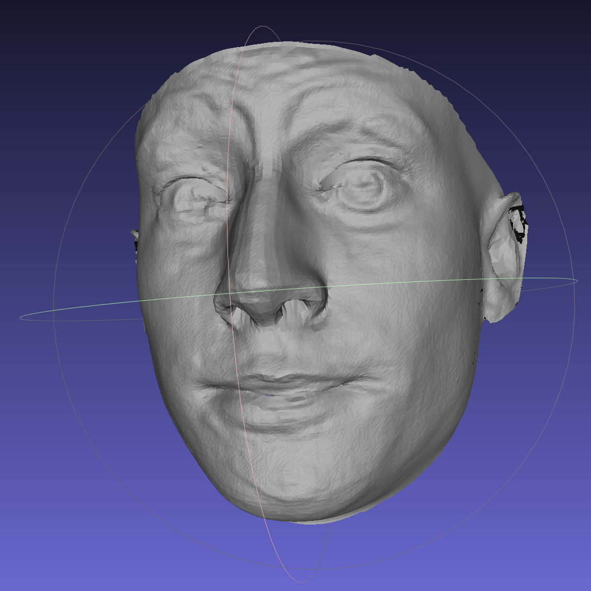
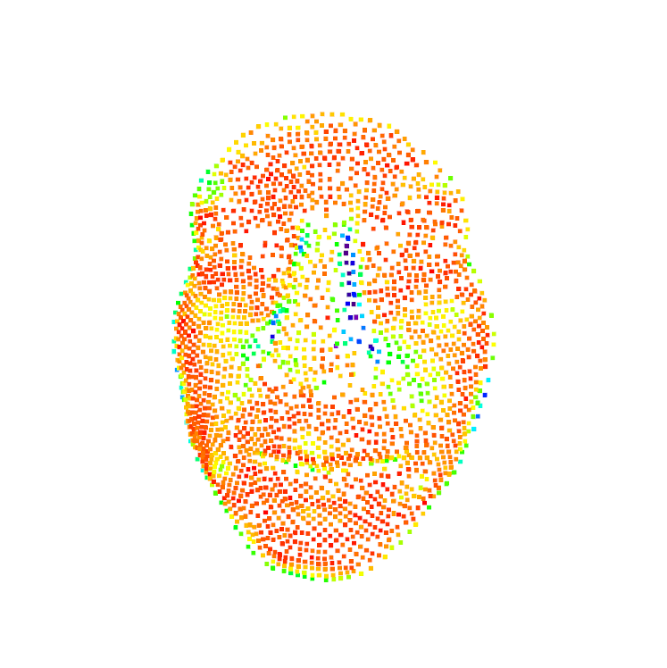

# PreprocessingFace2Dto3D
The project's aim is to compare the results obtained with the pretrained Extreme 3D 
Faces CNN (https://github.com/anhttran/extreme_3d_faces) and a ground truth using a 
well-known dataset (http://kunzhou.net/zjugaps/facewarehouse/) to measure the 
similarity between the two models and, hence, estimate the performance of the net.
</img>
</img>
</img>

## Dependencies
To build and run the files, you will need the following libraries:
- scikit-learn
- matplotlib
- pycpd
- numpy
- open3d
- scipy
- h5py

## How to make it work
To run the whole project, you are required to follow some steps. The parameters of 
each function will be explained in the next subsection. 
1. Download the [Extreme 3D Faces](https://github.com/anhttran/extreme_3d_faces) 
and follow the instructions to make it work correctly. Otherwise, you will need 
some 3D models from another CNN in a `.ply` format (in this case, you will also 
need to adapt the next steps).
2. Save the `.ply` files of the network in the `filePlyRete` folder.
3. Get the [FaceWarehouse dataset](http://kunzhou.net/zjugaps/facewarehouse/)
4. Copy the data of the dataset in a `faceWarehouse` folder.
5. Run the `plyTotxt()` function in `plyConverter.py` choosing the right values of 
the parameters. This will convert the `.ply` files 
in a bunch of `.txt` (stored in the `data` folder) files in order to make the 
next steps easier.
6. Run the `MatTotxt()` function in the `matConverter.py` file. This will convert 
the dataset's `.mat` 3D models in a `.txt` format and store them in a `groudtruth` 
folder.
7. Run `distancesTest()` in `test.py` to find out how much the two models are 
similar. If you want an overview of the accuracy of the different poses, you can 
also run `posesPrecision()`.
8. To build a heatmap of the alignment, you can run the `open3Dheatmap()` function 
in the `heatmap.py` file.

###### Parameters

- `plyTotxt()`: `directory` stands for the directory where you can find the `.ply` 
files. If you follow the steps above, this should be set to `'filePlyRete/'`; 
`compressionLevel` stands for the sampling parameter `K` of the KNNSearch algorithm: 
since a single model has over 130.000 points, you will probably need to sample 
the model (depending on your hardware). If you have a single-node cluster, we 
recommend you to leave this parameter to its default value; `radius` stands for 
the maximum distance (from the nose tip) of the useful points: the CNN we've 
used doesn't reconstruct the ears, while the ground truth models have also those 
points so, to make the results valid, we've focused just on the face setting this 
parameter properly.
- `MatTotxt()`: same as `plyTotxt()`
- `distancesTest()`: the FaceWarehouse dataset is structured this way: there are 150 
candidates and 20 poses for each candidate. This means we can choose a subset of the 
candidates and also a subset of poses to run the test. `testers` and `poses` are 
two lists in which you just need to put the number of the testers and the poses you 
want to test.
- `posesPrecision()`: same as `distancesTest()`
- `open3Dheatmap()`: `target` stands for the ground truth `.txt` model file path, 
while `source` stands for the CNN `.txt` model file path.
